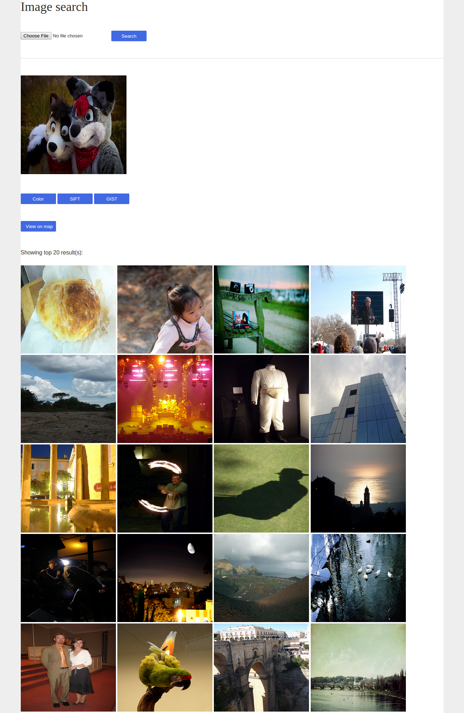

**Estimating GPS coordinates from an image**
- Upload an image.
- Click search. Searches for all similar images in the database.
- Predicts and indicates possible locations for the image on a google map. 
- You can base your search on either (http://docs.opencv.org/master/da/df5/tutorial_py_sift_intro.html#gsc.tab=0)[SIFT(local)],(http://people.csail.mit.edu/torralba/code/spatialenvelope/)[GIST(global)] or (https://en.wikipedia.org/wiki/Color_histogram)[color histogram]

**How to get it working on your system**

 Download Anaconda python for your system from: (https://www.continuum.io/downloads)

* Install the dependencies

  * conda install numpy
  *  conda install cv2
  * conda install scipy

opencv version currently supported = 2.4 that comes packaged with anaconda.
Support for other versions to be added soon.
SURF is available directly with opencv 2.4 which is why we are not using a newer version.

* clone the repo
* Start server

``` cd gps-estimation/contextslices/ ```
```  python manage.py runserver ```

* go to (http://127.0.0.1:8000/photo/list/)

**Screenshots**


